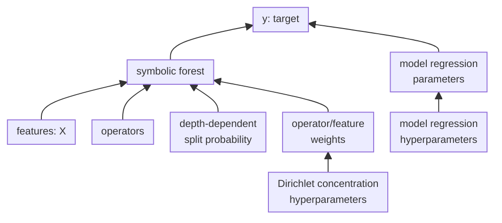
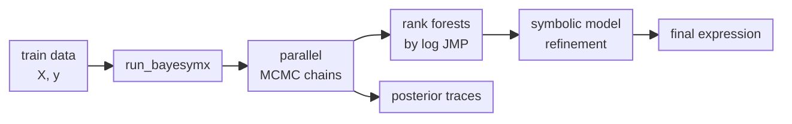
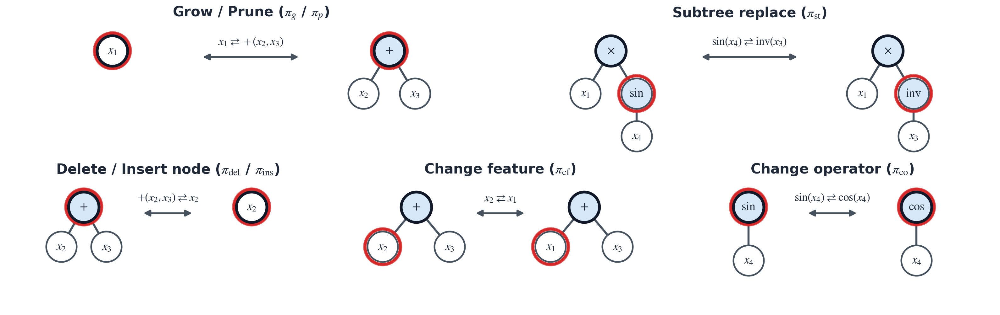

<div align="center">

# `BayeSym𝕏`

### `Baye`sian `Sym`bolic regression forests for e`𝕏`pression discovery

<p align="center">
  <a href="https://www.python.org/">
    
  </a>
  <a href="./LICENSE">
    
  </a>
  <a href="https://arxiv.org/abs/2509.19710">
    
  </a>
  <a href="https://github.com/Roy-SR-007/BayeSymX/network/members">
    
  </a>
  <a href="https://github.com/Roy-SR-007/BayeSymX">
    
  </a>
  <a href="https://github.com/Roy-SR-007/BayeSymX/commits/main">
    
  </a>
  <a href="https://github.com/Roy-SR-007/BayeSymX/issues">
    
  </a>
  <a href="https://github.com/Roy-SR-007/BayeSymX/pulls">
    
  </a>
</p>

`BayeSym𝕏` searches over forests of symbolic expression trees, ranks symbolic models across independent parallel MCMC chains, and reports an Occam's widow set of learned equations. Based on Roy, S., Dey, P., Mallick, B. K., & Pati, D. *Probabilistic Symbolic Regression for Equation Discovery via Operato-induced and Regularized Symbolic Forests*. (2026+; <https://arxiv.org/abs/2509.19710>)

</div>

---

## Overview of the `BayeSym𝕏` model

For a symbolic forest containing $K$ symbolic trees representing expressions (constructed recursively from features and operators), `BayeSym𝕏` models the response as

$$
y_i = \beta_0 + \sum_{j=1}^{K}\beta_j g(x_i; T_j) + \varepsilon_i,
\qquad \varepsilon_i \sim \mathcal N(0, \sigma^2),\; 1\leq i \leq n.
$$

Each MCMC explored forest $\mathcal{T} = (T_1, \ldots, T_K)$ is scored by the joint marginal posterior (JMP) distribution over symbolic forests:

$$
\log \operatorname{JMP}(\mathcal{T})
= \log \Pi(\mathcal{T}) + \log p(\bm{y} \mid \mathcal{T}, \bm{X}),
$$

where the symbolic tree prior $\Pi(\mathcal{T})$ is equipped with depth-dependent regularization to control symbolic expression complexity. Also, $p(\bm{y} \mid \mathcal{T}, \bm{X})$ is obtained after integrating out $(\bm{\beta}, \sigma^{2})$ with respect to their corresponding prior. The Dirichlet prior over operator and feature weight vectors of each tree enables data-adaptive learning of operator and feature preferences.



---

## Highlights

- **Posterior sampling** — executes parallel MCMC chains for efficient exploration of symbolic forest space.
- **Interpretable symbolic models** — constructs compact symbolic expressions (equations) using different mathematical (binary and unary) operators.
- **Symbolic model selection** — ranks using JMP over symbolic forests and retain an Occam's window set of expressions.
- **Compact final symbolic expressions** — performs post-MCMC symbolic model refinement using BIC and `SymPy`.
- **Train/test predictive accuracy** — reports train and test accuracy of learned expressions through RMSE, MAE, and $R^2$.
- **Posterior diagnostics** — provides parallel-chain log-JMP trace plots.



---

## Contents

- [Installation](#installation)
- [Quick start](#quick-start)
- [Main API](#main-api)
- [Prior parameters](#default-prior-parameters)
- [Operator set](#default-full-operator-set)
- [Symbolic tree moves](#symbolic-tree-moves)
- [Result schema](#result-schema)

---

## Installation

Clone the repository and enter the project directory:

```bash
git clone https://github.com/Roy-SR-007/BayeSymX.git
cd BayeSymX
```

Install the required packages (see below for details on required dependencies):

```bash
python -m pip install numpy pandas scipy matplotlib tqdm networkx sympy jupyter
```

### Dependencies

| Dependency | Used for |
|---|---|
| [NumPy](https://numpy.org/) | arrays, linear algebra, random sampling, predictions, and metrics |
| [pandas](https://pandas.pydata.org/) | result tables and tabular dataset loading |
| [SciPy](https://scipy.org/) | marginal likelihood and tree prior calculations |
| [Matplotlib](https://matplotlib.org/) | MCMC trace plots |
| [tqdm](https://tqdm.github.io/) | single- and multi-chain progress displays |
| [NetworkX](https://networkx.org/) | graph/tree utilities |
| [SymPy](https://www.sympy.org/) | symbolic conversion, simplification, factoring, and model size calculation |
| [Jupyter](https://jupyter.org/) | optional; required only to run `example.ipynb` interactively |

`json`, `pathlib`, `dataclasses`, `typing`, `math`, `random`, `copy`, `time`, `os`, `sys`, `shutil`, `queue`, `multiprocessing`, and `concurrent.futures` come from the `Python` standard library.

---

## Quick start

Consider the following toy example:

$$
y = 1.25 + 2.5\exp(x_0^3) - 0.8x_1^2\sin(x_0) + \varepsilon,
\qquad \varepsilon \sim \mathcal N(0, 0.15^2).
$$

```python
# import everything from BayeSymX directory
from BayeSymX import *

# simulated data generation
rng = np.random.default_rng(2026) # seed for data generation
X = rng.uniform(-2.0, 2.0, size=(2000, 2))
y = (
    1.25
    + 2.5 * np.exp(X[:, 0] ** 3)
    - 0.8 * X[:, 1] ** 2 * np.sin(X[:, 0])
    + rng.normal(0.0, 0.15, size=X.shape[0])
)

# Reproducible 90%/10% train-test split.
indices = rng.permutation(len(X))
train_indices = indices[:1800]
test_indices = indices[1800:]

# Configuring and fitting BayeSymX
result_json = run_bayesymx(
    X_train=X[train_indices],               # train data
    y_train=y[train_indices],
    X_test=X[test_indices],                 # optional test data
    y_test=y[test_indices],
    K=3,                                    # symbolic forest size
    maxdepth=3,                             # max. depth of symbolic trees
    seeds=[101, 202, 303, 404, 505],        # 5 parallel MCMC chains
    maxiter=2000,                           # MCMC iterations
    significant_digits=3,                   # signif. digits in constants    
    print_results=True,
    show_trace_plot=True,
)

# Convert the JSON output of results into Python dictionary
results = json.loads(result_json)
```


<div align="center">

### From symbolic tree structured expressions to compact scientific equations

Explore the complete runnable workflows in **[`example.ipynb`](example.ipynb)**.

</div>

---

## Main API

```python
run_bayesymx(
    X_train,
    y_train,
    K,
    maxdepth,
    seeds,
    prior_params=None,
    add_intercept=True,
    wts_init=None,
    wts_prop=None,
    opset=None,
    ftset=None,
    move_weights=None,
    maxiter=1000,
    burnin=0,
    thin=1,
    n_jobs=None,
    show_progress=True,
    report_every=10,
    r=10,
    X_test=None,
    y_test=None,
    force_intercept=False,
    blr_prior=None,
    prior_variance=10.0,
    rcond=None,
    significant_digits=6,
    print_results=False,
    show_trace_plot=False,
    save_trace_plot=False,
    trace_plot_path=None,
    trace_plot_dpi=300,
)

```

### Function arguments

| Argument | Required | Default | Meaning |
|---|:---:|:---:|---|
| **Required arguments** |  |  |  |
| `X_train` | Yes | — | Train feature matrix with shape `(n_train, p)` |
| `y_train` | Yes | — | Train response vector with length `n_train` |
| `K` | Yes | — | Number of symbolic trees in every forest |
| `maxdepth` | Yes | — | Maximum depth allowed for each symbolic tree |
| `seeds` | Yes | — | Nonempty sequence containing one integer seed per MCMC chain |
| **Model and prior controls** |  |  |  |
| `prior_params` | No | `None` | Optional `(alpha_op, alpha_ft, alpha, delta, beta0, V0, a0, b0)` prior specification; default priors are constructed when omitted; *see below* |
| `add_intercept` | No | `True` | Include an intercept in the regression model |
| `wts_init` | No | `None` | Initial operator and feature sampling weights, specified as `[op_weights, feature_weights]` |
| `wts_prop` | No | `None` | Operator and feature proposal weights used during MCMC |
| `opset` | No | `None` | Operator dictionaries available to the trees; `None` uses the complete default operator set; *see below* |
| `ftset` | No | `None` | Feature names; defaults to `x0`, `x1`, … and must follow the column order of `X_train` |
| `move_weights` | No | `None` | Mapping or seven-element sequence controlling the probabilities of MCMC symbolic tree moves; *see below* |
| **MCMC and parallel chain execution** |  |  |  |
| `maxiter` | No | `1000` | Number of MCMC iterations performed by each chain |
| `r` | No | `10` | Number of top log-JMP forests to post-process and return |
| `burnin` | No | `0` | Number of initial iterations excluded from retained states |
| `thin` | No | `1` | Retain every `thin`-th iteration after burn-in |
| `n_jobs` | No | `None` | Number of worker processes; defaults to `min(number_of_chains, CPU_count)` |
| `show_progress` | No | `True` | Display the launch banner and live parallel-chain progress |
| `report_every` | No | `10` | Number of iterations between worker-to-parent progress reports |
| **Test-data evaluation** |  |  |  |
| `X_test` | No | `None` | Optional held-out feature matrix; must be supplied together with `y_test` |
| `y_test` | No | `None` | Optional held-out response vector; must be supplied together with `X_test` |
| **Symbolic model refinement** |  |  |  |
| `force_intercept` | No | `False` | Require the BIC-selected reduced model to retain the intercept |
| `blr_prior` | No | `None` | Optional `(beta0_full, V0_full, a0, b0)` prior for reduced-model Bayesian linear regression |
| `prior_variance` | No | `10.0` | Fallback coefficient-prior variance used during model reduction |
| `rcond` | No | `None` | Numerical cutoff passed to least-squares and pseudoinverse calculations |
| **Results and formatting** |  |  |  |
| `significant_digits` | No | `6` | Number of significant digits used in expressions and formatted numerical output |
| `print_results` | No | `False` | Print the styled raw- and final-model result tables |
| **Trace plot controls** |  |  |  |
| `show_trace_plot` | No | `False` | Display the combined parallel-chain log-JMP trace plot |
| `save_trace_plot` | No | `False` | Save the trace plot to a file |
| `trace_plot_path` | No | `None` | Output file or directory; defaults to `./bayesymx_parallel_log_jmp_traces.png` when saving |
| `trace_plot_dpi` | No | `300` | Resolution, in dots per inch, used when saving the trace plot |

---

## Default prior parameters

When `prior_params=None`, `BayeSym𝕏` constructs the following prior parameters automatically:

| Prior parameter | Default value | Meaning |
|---|---|---|
| `alpha_op` | `np.ones(len(opset))` | Symmetric Dirichlet concentration parameters for operator usage |
| `alpha_ft` | `np.ones(len(ftset))` | Symmetric Dirichlet concentration parameters for feature usage |
| `alpha` | `0.95` | Initial depth-dependent splitting probability |
| `delta` | `1.20` | Rate at which the splitting probability decreases with tree depth |
| `beta0` | `np.zeros(K + int(add_intercept))` | Prior mean of the regression coefficients |
| `V0` | `10.0 * np.eye(K + int(add_intercept))` | Prior covariance matrix for the regression coefficients |
| `a0` | `0.05` | Prior shape-related parameter for the model variance |
| `b0` | `0.05` | Prior scale-related parameter for the model variance |

---

## Default full operator set

When `opset=None`, `BayeSym𝕏` considers the following full set of operators:

| Operator | Arity | Evaluation |
|---|---:|---|
| `add` | 2 | $x_1+x_2$ |
| `mul` | 2 | $x_1\times x_2$ |
| `neg` | 1 | $-x$ |
| `inv` | 1 | protected $1/x$, with near-zero values stabilized |
| `sin` | 1 | $\sin(x)$ |
| `cos` | 1 | $\cos(x)$ |
| `exp` | 1 | $\exp(x)$, with its argument clipped for numerical safety |
| `sq` | 1 | $x^2$ |
| `cu` | 1 | $x^3$ |
| `sqrt_op` | 1 | protected $\sqrt{\lvert x \rvert}$ |

Supply a restricted set when domain knowledge supports it, as below:

```python
result_json = run_bayesymx(
    ...,
    opset=[add, mul, sin, sq],
    ...
)
```

---

## Symbolic tree moves

The MCMC proposal kernel supports the following seven symbolic tree moves:

1. `grow`
2. `prune`
3. `change_feature`
4. `change_operator`
5. `subtree_replace`
6. `delete_node`
7. `insert_node`



When `move_weights=None`, `BayeSym𝕏` considers the following default move weights:

```python
move_weights = {
    "grow": 1.0,
    "prune": 1.0,
    "change_feature": 1.0,
    "change_operator": 1.0,
    "subtree_replace": 1.0,
    "delete_node": 1.0,
    "insert_node": 1.0,
}

# optionally you can set the move_weights also as
move_weights = [1, 1, 1, 1, 1, 1, 1]
```

---

## Result schema

`run_bayesymx()` returns a JSON string of results with the following hierarchy:

```text
result
├── parallel_chains_runtime_seconds
├── trace_plot_path
├── ranking_scale                  # "log_JMP"
├── selection_criterion            # "BIC"
├── significant_digits
├── top_r_requested
├── top_r_returned
└── models[]
    ├── rank
    ├── source
    │   ├── chain_id
    │   ├── chain_seed
    │   └── iteration
    ├── raw_model
    │   ├── expression
    │   ├── log_JMP
    │   ├── train_metrics          # RMSE, MAE, R2
    │   └── test_metrics           # metrics or null
    └── final_model
        ├── expression
        ├── BIC
        ├── effective_K
        ├── model_size
        ├── train_metrics
        └── test_metrics
```

---

